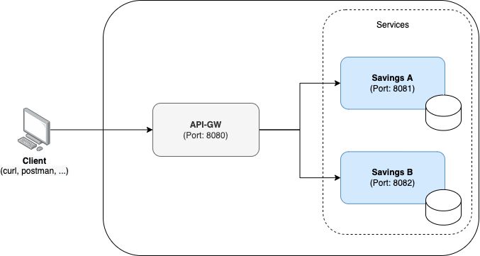

# Case Study Backend

A micro-services based platform to manage two savings accounts.



### Main actors:

- Simple Gateway Service
- Service-A
- Service-B

### Simple Gateway Service

Main responsibilities are to route requests to the appropriate service based on the request url,
handle timeouts, retries and log incoming requests.

### Service-A

Provides capabilities to manage the saving account `A`.

### Service-B

Provides capabilities to manage the saving account `B`.

## How to run the project

### Requirements

1. Java 17+
2. Docker
3. Build all required images
    - `cd gateway && ./gradlew jibDockerBuild && cd ../`
    - `cd service-a && ./gradlew jibDockerBuild && cd ../`
    - `cd service-b && ./gradlew jibDockerBuild && cd ../`
      This will build the images for the services and push them to the local repository.

### How to start the project

- Run the following command `docker-compose up -d` from the project root directory.
  This will start the services and all required infrastructure.
    - Service-A
    - Service-A-DB - postgreSQL database for Service-A
    - Service-B
    - Service-B-DB - postgreSQL database for Service-B
    - Three replicas of the Simple Gateway Service
    - nginx reverse proxy to forward requests to the Simple Gateway Service
- Run the following command `docker-compose down` to stop the project.

### How to test

The platform available at `http://localhost:8080/`

- Execute command `curl http://localhost:8080/savings/a/balance` to get the balance of the saving account `A`.
- Execute command `curl http://localhost:8080/savings/b/balance` to get the balance of the saving account `B`.
- Execute
  command `curl -X POST http://localhost:8080/savings/a/balance -H 'Content-Type: application/json' -d '{"amount": 100}'`
  to
  deposit `amount` to the saving account `A`. Change the `amount` value to deposit/credit a different amount.
- Execute
  command `curl -X POST http://localhost:8080/savings/b/balance -H 'Content-Type: application/json' -d '{"amount": 150}'`
  to
  deposit `amount` to the saving account `B`. Change the `amount` value to deposit/credit a different amount.

### Q&A

#### How to scale simple gateway service?

- Add more replicas of the Simple Gateway Service by changing number of replicas in `docker-compose.yml` file. Nginx
  will forward requests to the new replicas automatically via Docker DNS resolution.

```
  deploy:
      mode: replicated
      replicas: 3
``` 

#### How to monitor uptime?

There are several approaches:

- Kubernetes + liveliness and readiness probes - for example, see the following link:
  [https://kubernetes.io/docs/tasks/configure-pod-container/configure-liveness-readiness-startup-probes/](https://kubernetes.io/docs/tasks/configure-pod-container/configure-liveness-readiness-startup-probes/)
- Prometheus metrics + grafana alerts - for example, see the following link:
  [https://prometheus.io/docs/introduction/](https://prometheus.io/docs/introduction/)
  and [https://grafana.com/grafana/grafana-alerting/](https://grafana.com/grafana/grafana-alerting/)

#### How to secure the platform?

- Setup IDP, for example, [https://www.keycloak.org/](https://www.keycloak.org/)
  or [https://www.okta.com/](https://www.okta.com/) and setup the platform to use it for JWT validation.
